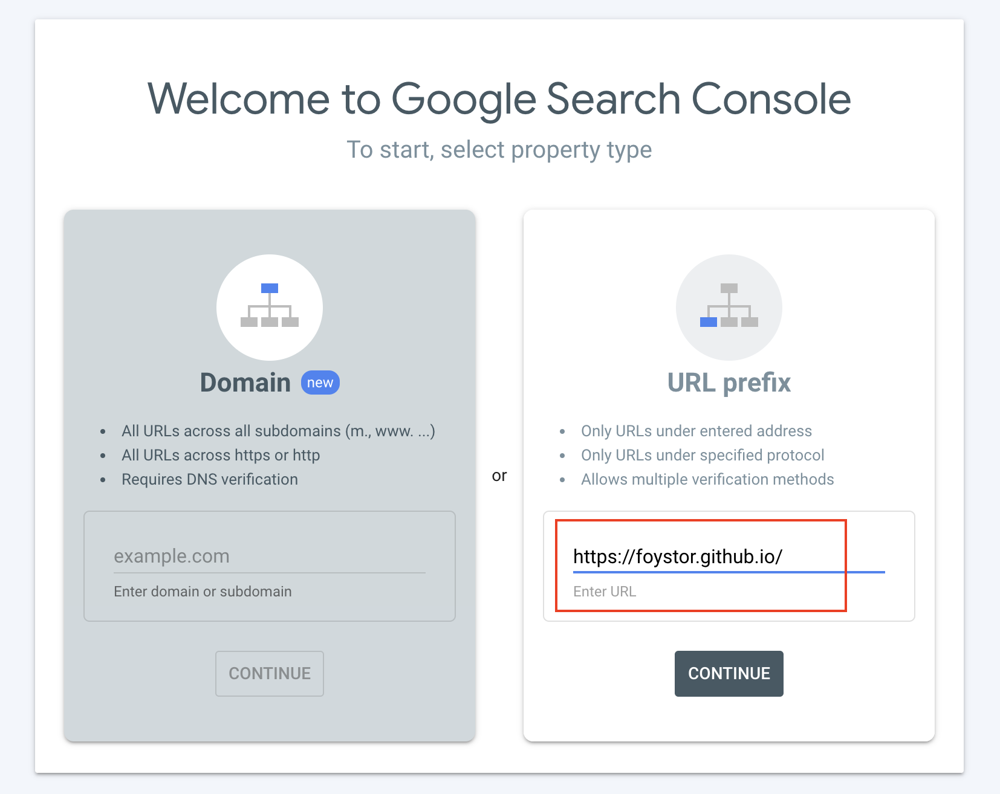

# Add Google Search Console (GSC) to hexo blog

## Install hexo-sitemap
```
npm install hexo-generator-sitemap --save
```
Add configuration to _config.yml
```
sitemap:
    path: sitemap.xml
```
This will automatically generate a sitemap every time after deploying the website.

## Verify the ownership of your site in GSC
1. Go to [GSC website](https://search.google.com/search-console/about)
2. Under URL prefix, enter your homepage URL.

3. Click Continue
4. Use “Recommended verification methods”, i.e HTML file.
5. Download the automatically generated .html file.
6. Put this .html file into the *source* folder of your blog. (not _post, not anything, just root *source* folder)
7. !IMPORTANT (This has been a big issue for me) Set layout as false in the frontal info of this .html file, otherwise you will get error with verification.
```
# originally:
google-site-verification: googlee6edfc5f795da21a.html

# now change to:
---
layout: false
---
google-site-verification: googlee6edfc5f795da21a.html
```
8. Alternative way for verification is to use HTML tag, see [this post](https://foystor.github.io/2022/08/16/show-hexo-blog-on-google-search/)
9. Add sitemap.xml to sitemap of GSC
10. You are all set! After a while of waiting, tap *site: your-blog-address* into google search window to check if your blog has been properly tracked by GSC.